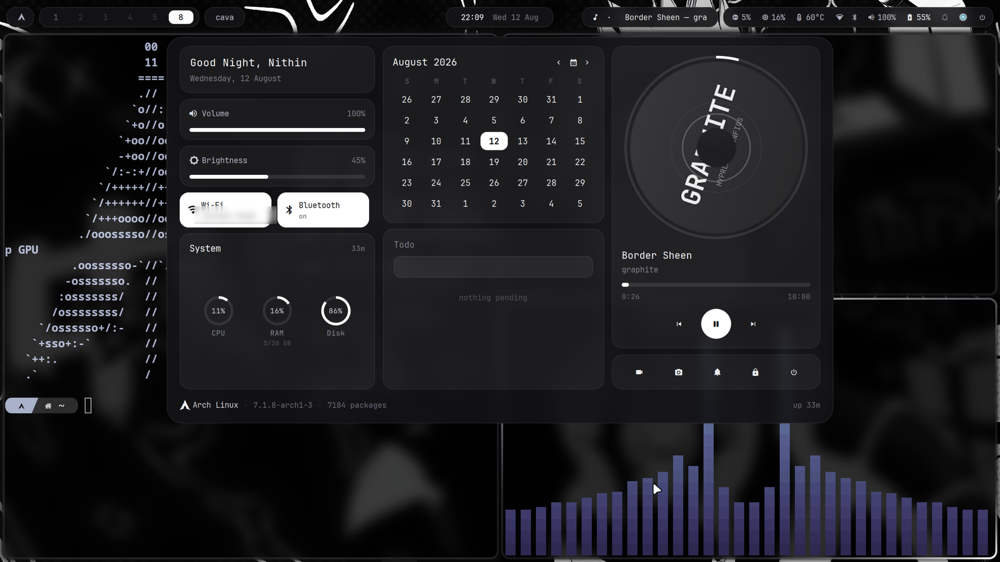
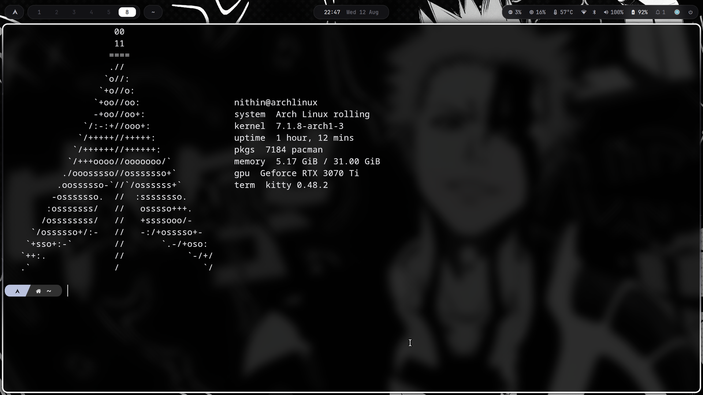
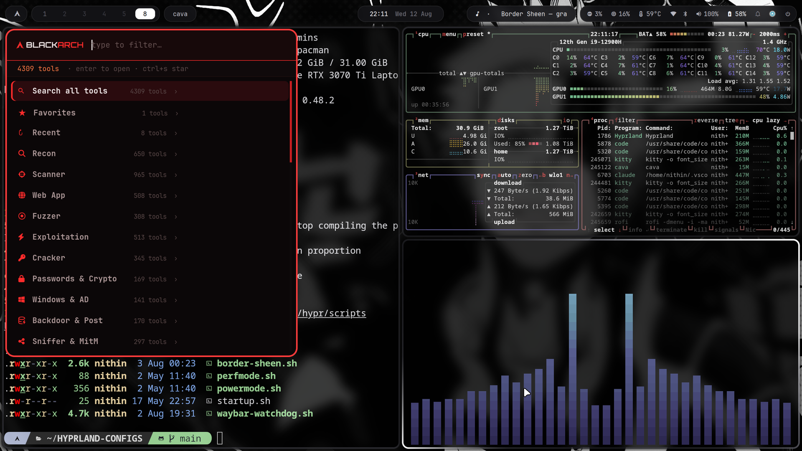
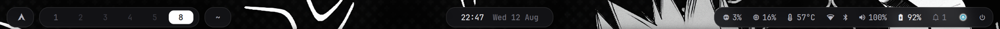
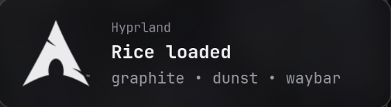

<div align="center">

# HYPRLAND-CONFIGS

**A graphite‑monochrome Hyprland rice for Arch Linux.**
Built on [HyDE](https://github.com/HyDE-Project/HyDE), rebuilt around a custom Waybar, a
hand‑written notification theme, an eww dashboard, and ROG laptop hardware controls.

[](https://archlinux.org)
[](https://hyprland.org)
[](https://github.com/Alexays/Waybar)
[](https://wayland.freedesktop.org)
[](LICENSE)



</div>

---

## Table of contents

- [What this is](#what-this-is)
- [Gallery](#gallery)
- [The stack](#the-stack)
- [Install](#install)
  - [One command](#one-command)
  - [What the installer actually does](#what-the-installer-actually-does)
  - [By hand](#by-hand)
- [After installing](#after-installing)
  - [Your monitor](#your-monitor)
  - [Not on NVIDIA](#not-on-nvidia)
  - [Not on an ROG laptop](#not-on-an-rog-laptop)
- [Keybindings](#keybindings)
- [Repo layout](#repo-layout)
- [Design notes](#design-notes)
- [Troubleshooting](#troubleshooting)
- [Credits](#credits)

---

## What this is

A complete, restorable copy of one working desktop — not a theme pack. If this
machine's `~/.config` is deleted tomorrow, cloning this repo and running
`./install.sh` puts the whole thing back: packages, configs, scripts, fonts,
services and hardware daemons.

It started as HyDE and diverged. The parts that are original here:

| | |
|---|---|
| **Graphite Waybar** | A second bar living in `config/waybar/graphite/`, used instead of HyDE's. Transparent bar, glass chips, one status group on the right. |
| **Monochrome borders with a live sheen** | No RGB. The focused window wears a white‑to‑graphite gradient that slowly rotates, driven by [`border-sheen.sh`](config/hypr/scripts/border-sheen.sh). |
| **Waybar watchdog** | [`waybar-watchdog.sh`](config/hypr/scripts/waybar-watchdog.sh) supervises the bar so a Waybar/GTK crash doesn't leave you with no bar until reboot. |
| **eww dashboard** | Calendar, todo board, and an MPRIS music widget with a spinning disc — `config/eww/`. |
| **Graphite notifications** | dunst restyled into frosted cards that slide in from the right, with a compositor blur layer rule behind them. |
| **ROG hardware wiring** | `asusctl` fan profiles, keyboard aura cycling, `supergfxctl` Optimus switching, OpenRGB, and a patched numberpad driver. |
| **BlackArch launcher** | A rofi front‑end over ~895 BlackArch tools, categorised — `config/blackarch-launcher/`. |

Nearly every config file in here is commented with *why* a setting exists,
usually because something broke and the comment is the post‑mortem. Those
comments are the most useful thing in the repo — read them before changing a
value.

---

## Gallery

### The dashboard

Dropped from the clock with `SUPER` `D`. Greeting, volume and brightness
sliders, network and bluetooth chips, CPU/RAM/disk meters, a month calendar, a
todo board — and an album disc that actually spins, rendered frame by frame
from the current track's cover art by
[`disc_spin.py`](config/eww/scripts/disc_spin.py).


### The terminal

kitty at 82 % opacity, zsh with Powerlevel10k, and a graphite fastfetch card
on every new shell — the BlackArch lockup in white, system on the right,
nothing else.



### The BlackArch toolbox

A two‑level rofi menu over an index of **4309 runnable tools**, categorised.
`ALT` `S`. A tool with a GUI opens its GUI; a CLI tool opens a themed terminal
showing its usage and flags before dropping into a shell scoped to it.
Red‑on‑black on purpose — the one part of the desktop that is allowed colour,
because it is a different mode of working.



### The bar

launcher · workspaces · window title | clock | now‑playing · status group



<table>
<tr>
<td width="46%"></td>
<td width="54%"><sub><b>Notifications</b> — dunst, restyled as frosted cards
that slide in from the right. dunst cannot animate and cannot blur, so both
come from compositor <code>layerrule</code>s in
<a href="config/hypr/windowrules.conf">windowrules.conf</a>.</sub></td>
</tr>
</table>

**Wallpaper** — `Vanta Black` (one of 30 HyDE themes shipped in `config/hyde/themes/`)


---

## The stack

| Role | Program | Config |
|---|---|---|
| Compositor | Hyprland 0.56 | [`config/hypr/`](config/hypr/) |
| Bar | Waybar 0.15 | [`config/waybar/graphite/`](config/waybar/graphite/) |
| Notifications | dunst 1.13 | [`config/dunst/dunstrc`](config/dunst/dunstrc) |
| Launcher / menus | rofi 2.0 | [`config/rofi/`](config/rofi/) |
| Dashboard | eww 0.6 | [`config/eww/`](config/eww/) |
| Lock screen | hyprlock | [`config/hypr/hyprlock.conf`](config/hypr/hyprlock.conf) |
| Idle | hypridle | `config/hypr/` |
| Wallpaper | `awww` (Arch's swww fork) | `config/hyde/themes/*/wallpapers/` |
| Terminal | kitty 0.48, 82 % opacity | [`config/kitty/`](config/kitty/) |
| Files | Thunar | — |
| Shell | zsh + Powerlevel10k | [`.zshrc`](.zshrc), [`.p10k.zsh`](.p10k.zsh) |
| Fetch | fastfetch | [`config/fastfetch/`](config/fastfetch/) |
| Monitor | btop | [`config/btop/`](config/btop/) |
| Visualiser | cava | [`config/cava/`](config/cava/) |
| Gestures | fusuma (3/4‑finger) | [`config/fusuma/config.yml`](config/fusuma/config.yml) |
| Theme engine | HyDE + wallbash | [`config/hyde/`](config/hyde/) |
| Font | JetBrainsMono Nerd Font | — |
| GTK / icons / cursor | Vanta‑Black · Tela‑circle‑black · Bibata‑Modern‑Ice | [`config/gtk-3.0/`](config/gtk-3.0/) |

**Built and tested on:** ASUS ROG laptop · Intel i9‑12900H · RTX 3070 Ti Laptop
(Optimus) · 32 GB RAM · 2560×1440 @ 240 Hz internal panel, `1.67` scale · Arch
Linux rolling, kernel 7.1.

---

## Install

> **Read this first.** The installer replaces files under `~/.config`. It backs
> up everything it touches to `~/.config-backup-<timestamp>/` before writing,
> and prints that path when it finishes. Run `./install.sh --dry-run` to see
> every action first without changing anything.

### One command

```bash
git clone https://github.com/nithin2719-commits/HYPRLAND-CONFIGS.git
cd HYPRLAND-CONFIGS
./install.sh
```

<sub>The repo is large (it ships 30 themes and their wallpapers). For a
config‑only clone: `git clone --depth 1 …`</sub>

Useful flags:

| Flag | Effect |
|---|---|
| `--dry-run` | Print every action, change nothing. Do this first. |
| `--configs-only` | Skip package installation, deploy dotfiles only. |
| `--packages-only` | Install packages, touch no config. |
| `--no-aur` | Skip the AUR stage entirely (no `yay` bootstrap). |
| `--no-nvidia` | Skip the NVIDIA driver packages. |
| `--yes` | Don't prompt for confirmation. |

### What the installer actually does

1. **Preflight** — confirms Arch, refuses to run as root, confirms you're in the repo.
2. **Repo packages** — `pacman -S --needed` over the 86 packages in
   [`packages/rice-core.txt`](packages/rice-core.txt). Every name in that file
   is verified to resolve in `core`/`extra`/`multilib`.
3. **AUR** — bootstraps `yay` from source if neither `yay` nor `paru` is present,
   then installs the 21 packages in [`packages/aur-core.txt`](packages/aur-core.txt).
4. **Backup** — copies anything it's about to overwrite into `~/.config-backup-<timestamp>/`.
5. **Configs** — `config/*` → `~/.config/`, `local/share/bin/` → `~/.local/share/bin/`,
   and the shell dotfiles → `~/`.
6. **Services** — enables `power-profiles-daemon`, `supergfxd`, `asusd` and the
   PipeWire user units, each only if that unit actually exists.
7. **Gestures** — adds you to the `input` group so fusuma can read the touchpad.
8. **Font cache** — `fc-cache -f`.

`~/.gitconfig` is in the repo but is **deliberately not installed** — it carries
a git identity and a credential helper, which belong to a person rather than to
a desktop.

### By hand

If you'd rather not run the script:

```bash
# 1. packages
sudo pacman -Syu --needed - < <(grep -vE '^\s*(#|$)' packages/rice-core.txt)
yay  -S    --needed - < <(grep -vE '^\s*(#|$)' packages/aur-core.txt)

# 2. back up what you have
cp -a ~/.config ~/.config.bak

# 3. configs
cp -a config/.            ~/.config/
cp -a local/share/bin/.   ~/.local/share/bin/
cp -a .zshrc .zprofile .bashrc .bash_profile .p10k.zsh .gtkrc-2.0  ~/
chmod +x ~/.local/share/bin/* ~/.config/hypr/*.sh ~/.config/hypr/scripts/*.sh

# 4. services
sudo systemctl enable --now power-profiles-daemon supergfxd asusd
systemctl --user enable --now pipewire pipewire-pulse wireplumber
sudo gpasswd -a "$USER" input        # fusuma gestures
fc-cache -f
```

`packages/pacman-explicit-full.txt` and `packages/all-installed.txt` are the
complete package dumps from this machine, kept for reference — they include the
whole BlackArch toolset and are **not** what you want for a desktop install.

---

## After installing

### Your monitor

`config/hypr/monitors.conf` is hard‑coded to this laptop's panel:

```ini
monitor = eDP-1,2560x1440@240,0x0,1.67
```

Change it. `hyprctl monitors` prints your outputs and their modes; the syntax is
`monitor = NAME,RESOLUTION@HZ,POSITION,SCALE`. To let Hyprland pick:

```ini
monitor = ,preferred,auto,1
```

If text is the wrong size after that, the scale is also referenced in
`QT_SCALE_FACTOR` (`config/hypr/hyprland.conf`) and in the eww/calendar window
positions in `config/hypr/windowrules.conf`.

### Not on NVIDIA

Empty out `config/hypr/nvidia.conf` (or delete its contents after install) and
run the installer with `--no-nvidia`. The NVIDIA‑specific environment variables
at the bottom of `hyprland.conf` — `GBM_BACKEND`, `NVD_BACKEND`,
`__GLX_VENDOR_LIBRARY_NAME`, `LIBVA_DRIVER_NAME`, `WLR_DRM_NO_ATOMIC`,
`AQ_DRM_DEVICES` — should go too. Leaving them set on AMD or Intel will give you
a black screen or a software‑rendered session.

### Not on an ROG laptop

These will fail harmlessly (the binaries just won't exist), but you can delete them:

- `bind = , F4, exec, asusctl aura effect --next-mode` — keyboard aura cycling
- `F2` / `F3` — `brightnessctl -d asus::kbd_backlight`
- `XF86Launch1` / `XF86Launch4` → `powerprofile_toggle.sh`, `scripts/perfmode.sh`
- `exec-once = … openrgb --device 0 --mode "Rainbow Wave"`
- `numberpad.py` — the ASUS touchpad numpad driver

See [`docs/TROUBLESHOOTING.md`](docs/TROUBLESHOOTING.md) for the full list.

---

## Keybindings

`SUPER` is the mod key. Full list: **`SUPER + /`** in‑session, or
[`docs/KEYBINDINGS.md`](docs/KEYBINDINGS.md).

<table>
<tr><td valign="top" width="50%">

**Launch**

| Keys | Action |
|---|---|
| `SUPER` `T` | Terminal (kitty) |
| `SUPER` `E` | Files (Thunar) |
| `SUPER` `F` | Browser (Firefox) |
| `SUPER` `A` | App launcher (rofi) |
| `SUPER` `C` | Tor Browser |
| `ALT` `Z` | YouTube |
| `ALT` `X` | WhatsApp |
| `ALT` `V` | ChatGPT |
| `ALT` `S` | BlackArch launcher |

**Window**

| Keys | Action |
|---|---|
| `SUPER` `Q` | Close |
| `SUPER` `W` | Float |
| `SUPER` `G` | Group |
| `SUPER` `J` | Toggle split |
| `ALT` `Return` / `F11` | Fullscreen |
| `ALT` `Tab` | Cycle windows |
| `SUPER` `←↑↓→` | Move focus |
| `SUPER` `SHIFT` `←↑↓→` | Resize |
| `SUPER` `Z` / `X` | Drag‑move / drag‑resize |

</td><td valign="top" width="50%">

**Workspaces**

| Keys | Action |
|---|---|
| `SUPER` `1‑0` | Switch |
| `SUPER` `SHIFT` `1‑0` | Move window there |
| `SUPER` `ALT` `1‑9` | Move window there, silently |
| `SUPER` `CTRL` `←/→` | Previous / next |
| `SUPER` `CTRL` `↓` | First empty |
| `SUPER` `S` | Scratchpad |
| `SUPER` `D` | Magic workspace |

**Rice controls**

| Keys | Action |
|---|---|
| `SUPER` `SHIFT` `T` | Theme select |
| `SUPER` `SHIFT` `W` | Wallpaper select |
| `SUPER` `ALT` `←/→` | Previous / next wallpaper |
| `SUPER` `ALT` `↑/↓` | Cycle Waybar mode |
| `SUPER` `SHIFT` `A` | Rofi style select |
| `SUPER` `ALT` `A` | Animation preset |
| `CTRL` `ALT` `W` | Toggle Waybar |
| `F4` | Cycle keyboard aura (ROG) |

**System**

| Keys | Action |
|---|---|
| `SUPER` `L` | Lock (hyprlock) |
| `SUPER` `Escape` | Logout menu |
| `SUPER` `P` | Region screenshot |
| `SUPER` `ALT` `P` | Monitor screenshot |
| `SUPER` `V` | Clipboard history |
| `SUPER` `N` | Replay last notification |
| `SUPER` `SHIFT` `N` | Clear notifications |
| `SUPER` `/` | Keybinding cheatsheet |

</td></tr>
</table>

---

## Repo layout

```
HYPRLAND-CONFIGS/
├── install.sh                  ← bootstrap: packages, configs, services
├── README.md
├── assets/                     ← the screenshots in this file
├── docs/
│   ├── KEYBINDINGS.md          ← every bind, grouped
│   └── TROUBLESHOOTING.md      ← known breakages and their fixes
├── packages/
│   ├── rice-core.txt           ← 86 repo packages, all verified to resolve
│   ├── aur-core.txt            ← 21 AUR packages the rice uses
│   ├── aur.txt                 ← every foreign package on this machine
│   ├── pacman-explicit-full.txt
│   └── all-installed.txt
├── config/                     → deploys to ~/.config/
│   ├── hypr/                   ← compositor: binds, rules, scripts, themes
│   │   ├── hyprland.conf
│   │   ├── keybindings.conf
│   │   ├── windowrules.conf
│   │   ├── userprefs.conf      ← sourced LAST; overrides everything
│   │   ├── monitors.conf       ← edit this for your display
│   │   ├── nvidia.conf         ← empty this on AMD/Intel
│   │   └── scripts/            ← border-sheen, waybar-watchdog, perf modes
│   ├── waybar/
│   │   ├── graphite/           ← the bar that is actually used
│   │   └── …                   ← HyDE's generated bar, kept as fallback
│   ├── eww/                    ← calendar + todo + music dashboard
│   ├── dunst/                  ← graphite notification cards
│   ├── rofi/  wofi/  wlogout/  swaync/
│   ├── kitty/ btop/ cava/ fastfetch/ fusuma/
│   ├── hyde/                   ← 30 themes + wallpapers (this is the bulk)
│   └── blackarch-launcher/     ← rofi front-end over the BlackArch toolset
└── local/share/bin/            → deploys to ~/.local/share/bin/
                                  HyDE's scripts + the custom ones
                                  (graphite-calendar, notif-center, vol-osd,
                                   bright-osd, cal-remind, song-spin, …)
```

**Load order matters.** `hyprland.conf` sources, in this order:
`keybindings.conf` → `windowrules.conf` → `themes/common.conf` →
`themes/theme.conf` → `themes/colors.conf` → `monitors.conf` →
`userprefs.conf` → `nvidia.conf`. Because `userprefs.conf` is near the end, what
it sets wins over both HyDE's theme and its wallbash colours — which is exactly
why the monochrome borders survive a wallpaper change.

---

## Design notes

**One surface, not a palette.** The bar is transparent and the chips are
blurred; the notification cards are the same glass; rofi gets the same layer
rule. Nothing on the desktop is coloured except application content. Focus is
communicated by *brightness*, not hue — the active window's border is the only
bright edge on the screen.

**The border sheen is a script, not an animation.** Hyprland 0.56.1's
`animation = borderangle … loop` reports itself as enabled but the rendered
gradient does not advance — sampled across frames, the border pixels are
byte‑identical. So [`border-sheen.sh`](config/hypr/scripts/border-sheen.sh)
rotates `col.active_border` by 2° every 35 ms instead. This replaced an older
`rgb.sh` that fired 33 `hyprctl` calls a second and pinned every window to a
rainbow, overriding every other border setting in the config.

**The bar is supervised.** Waybar 0.15 on GTK 3.24 segfaults inside `libgdk-3`
when the GTK cursor theme is reloaded — which HyDE does on every theme switch.
Nothing restarted it, so the bar looked like it had permanently vanished.
[`waybar-watchdog.sh`](config/hypr/scripts/waybar-watchdog.sh) respawns it on
crash, stays down when it's killed on purpose, gives up after 10 crashes in 60 s,
and hands the lock over cleanly when a theme switch launches a new supervisor.

**One daemon per job.** A recurring failure mode in this config was two programs
owning the same responsibility: dunst *and* swaync both claiming
`org.freedesktop.Notifications`; swayosd *and* dunst both drawing volume popups;
`nm-applet`/`blueman-applet` adding tray icons that duplicated the bar's own
chips; two `hyprlock` instances from a duplicated bind. Every one of those is
now disabled with a comment explaining what it collided with. Read those
comments before re‑enabling anything.

---

## Troubleshooting

Common ones, in full: [`docs/TROUBLESHOOTING.md`](docs/TROUBLESHOOTING.md).

| Symptom | Cause |
|---|---|
| Black screen after login | NVIDIA env vars set on non‑NVIDIA hardware — see [Not on NVIDIA](#not-on-nvidia) |
| No bar | Watchdog gave up, or a stale lock. `pkill waybar; ~/.config/hypr/scripts/waybar-watchdog.sh &` |
| Everything is the wrong size | `monitors.conf` scale vs `QT_SCALE_FACTOR` in `hyprland.conf` |
| Notifications unstyled | Two daemons racing for the dbus name — only dunst should start |
| Gestures dead | Not in the `input` group; log out and back in after `gpasswd` |
| Wallpaper doesn't load | Arch renamed swww to `awww`; `awww-daemon` must be running |

---

## Credits

- [**HyDE**](https://github.com/HyDE-Project/HyDE) by *prasanthrangan* — the base
  this rice grew out of. The theme engine, wallbash, and most of
  `~/.local/share/bin` are theirs.
- [**Hyprland**](https://hyprland.org) by *vaxerski*.
- [**Waybar**](https://github.com/Alexays/Waybar), [**dunst**](https://github.com/dunst-project/dunst),
  [**rofi**](https://github.com/davatorium/rofi), [**eww**](https://github.com/elkowar/eww).
- Bundled themes and wallpapers belong to their respective authors.

---

<div align="center">
<sub>Configs are MIT. Wallpapers, fonts and bundled GTK themes keep their own licences.</sub>
</div>
